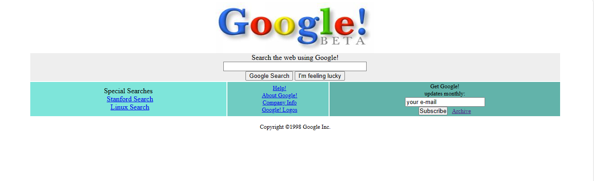

# Google 1998

 [Kodluyoruz](https://kodluyoruz.org/) Front-End Eğitimi kapsamında Google 1998 versiyonu yeniden tasarlanarak klonlandı.  



## Installation

Öncelikle projeyi klonlayın. 
```bash
git clone https://github.com/melikeisk/Google-1998.git
```

## Usage

Projeyi klonladıktan sonra VS Code programında açınız.

## Contributing

Pull requestler kabul edilir.

## License

[MIT](https://choosealicense.com/licenses/mit/)